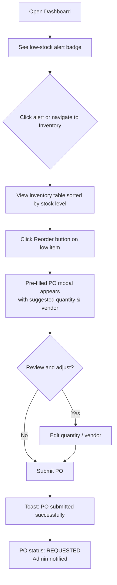
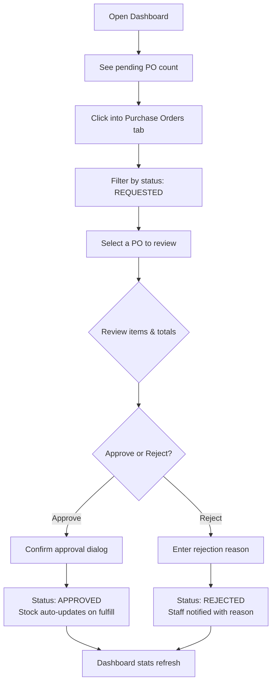
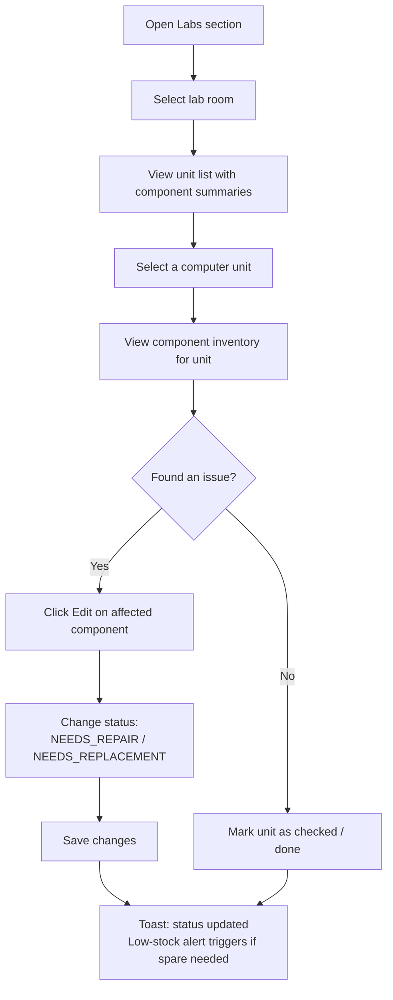

# UX Design Specification intelligent-procurement-inventory

**Author:** Administrator
**Date:** 2026-07-02

---

<!-- UX design content will be appended sequentially through collaborative workflow steps -->

## Executive Summary

### Project Vision

A procurement and inventory management system for the Computer Studies Department that looks and feels like a polished internal tool, reflecting department branding through intentional use of the department color palette.

### Target Users

- **Lab Technicians / STAFF** — handle day-to-day inventory management, stock checks, and procurement requests
- **Administrators / ADMIN** — oversee approvals, manage vendors, and configure system settings

### Key Design Challenges

- Transforming a basic monochrome UI into a branded, visually polished experience
- Maintaining clarity and readability with a strong red accent (`#970301`) that must not visually overwhelm or falsely signal danger
- Balancing visual appeal with quick task completion for busy lab staff who need efficiency

### Design Opportunities

- Deep red `#970301` as primary brand accent for headers, buttons, and key interactive elements
- Yellow `#ffee29` used sparingly as a vibrant highlight for status indicators, alerts, or call-to-action emphasis
- Near-black `#121212` text on light gray `#ebebeb` backgrounds for crisp, accessible readability
- Neutral mid-gray `#a9a9a9` for secondary text, borders, and subtle dividers

## Core User Experience

### Defining Experience
Dual-purpose system: (1) **Asset tracking** — map computer lab hardware (rooms to units to components) with status visibility, and (2) **Procurement** — monitor spare parts inventory and trigger purchase requests when stock runs low.

### Platform Strategy
Desktop-first web application (Next.js) optimized for mouse and keyboard, with responsive layout for mobile stock checks. No offline requirement.

### Effortless Interactions
- Low-stock indicators visible at a glance on every inventory screen
- Smart reorder suggestions (AI-powered) to eliminate manual reorder calculations
- One-click purchase request creation from low-stock alerts
- Status badges that communicate component health without reading text

### Critical Success Moments
- Staff sees a low-stock alert and creates a purchase order in under 30 seconds
- Admin reviews and approves a purchase order in one glance
- Dashboard shows exactly what needs attention at the start of the day

### Experience Principles
1. **Glanceable** — key info (stock levels, status) readable in under 2 seconds
2. **Efficient** — common tasks (log component, create purchase order) in minimal clicks
3. **Trustworthy** — clear status indicators, no ambiguity about what needs action
4. **Branded** — gray-based professional UI with subtle school color accents

## Desired Emotional Response

### Primary Emotional Goals
- **Confident** — staff trust the data and act decisively on low-stock alerts
- **Efficient** — completing tasks feels fast, not a chore
- **In Control** — dashboard gives a clear picture of what needs attention

### Emotional Journey Mapping
- **First use:** Slight curiosity — "oh this actually looks like our department's tool"
- **Daily use:** Quiet efficiency — familiar, fast, no surprises
- **After task completion:** Satisfaction — "done, and it took 2 clicks"
- **Error state:** Reassurance — clear messaging, undo/retry options, no panic
- **Return visit:** Comfort — muscle memory kicks in, everything is where expected

### Micro-Emotions
- **Confidence** over Confusion — status badges, clear labels, predictable layout
- **Trust** over Skepticism — accurate stock levels, transparent approval trail
- **Accomplishment** over Frustration — quick create flows, minimal form friction

### Design Implications
- **Confidence** → Consistent UI patterns, clear status colors, predictable navigation
- **Efficiency** → Keyboard shortcuts, bulk actions, smart defaults on forms
- **In Control** → Prominent low-stock alerts, sortable/searchable tables, at-a-glance dashboard
- **Gray primary palette** → Professional, calm, understated — the red/yellow accents add just enough energy without noise

### Emotional Design Principles
1. Don't make users think — every screen should be self-explanatory
2. Reward efficiency — the fastest path should feel like the natural path
3. Errors are recoverable — never leave users stranded
4. Familiar over fancy — this is a work tool, not a game

## UX Pattern Analysis & Inspiration

### Inspiring Products Analysis
- **Linear (project management)** — Kanban-style boards, clean gray-based UI with subtle accent colors for status. Fast, keyboard-driven, thoughtful micro-interactions.
- **Notion (documentation/knowledge)** — Left sidebar navigation, minimal chrome, content-focused layouts that work equally well for lists, tables, and documents.
- **Vercel Dashboard (admin/ops)** — Dark/light mode, at-a-glance stat cards, clear data tables with inline actions, muted color palette with intentional accent pops.

### Transferable UX Patterns
- **Sidebar navigation** (Notion-like) — persistent left rail for Labs / Inventory / Vendors / Purchase Orders / Dashboard, collapsing to icons on smaller screens
- **Stat cards** (Vercel-like) — top-of-page row showing total items, low-stock count, pending approvals, active POs
- **Status badges** (Linear-like) — colored pills for component status (green=FUNCTIONAL, yellow=NEEDS_REPAIR, red=NEEDS_REPLACEMENT) and PO status (blue=DRAFT, amber=REQUESTED, green=APPROVED)
- **Inline editing** — edit inventory items directly in table rows without opening modals

### Anti-Patterns to Avoid
- **Over-navigation** — don't bury common actions behind 3+ clicks
- **Modal overload** — avoid modals for viewing data (modals ok for create/edit but not for read-only)
- **Color overload** — with a gray base and red/yellow accents, resist the urge to add more colors; every color must mean something
- **Cluttered dashboards** — don't show every metric; show only what needs attention today

### Design Inspiration Strategy
- **Adopt:** Sidebar nav + stat cards + status badges for a clean, familiar internal-tool feel
- **Adapt:** Linear's minimal aesthetic but with the department gray palette + school accent colors
- **Avoid:** Dense enterprise-table sprawl — use spacing, typography, and color to breathe

## Design System Foundation

### 1.1 Design System Choice
**Tailwind CSS 4 + shadcn (Radix UI)** — already the project's UI foundation. Thematically customizable via CSS variables and Tailwind config.

### Rationale for Selection
- Already in the stack — zero new dependency cost
- shadcn provides accessible, proven primitives (modals, dropdowns, tables, badges)
- Tailwind's utility-first approach makes color token overrides straightforward
- Themeable by nature — perfect for mapping the department palette without fighting the framework

### Implementation Approach
1. Override `--primary`, `--accent`, `--muted`, `--destructive` CSS variables in `globals.css` for shadcn components
2. Add custom Tailwind colors for the department palette:
   - `dept-gray-100` → `#ebebeb`
   - `dept-gray-400` → `#a9a9a9`
   - `dept-gray-900` → `#121212`
   - `dept-red` → `#970301`
   - `dept-yellow` → `#ffee29`
3. Map `dept-red` to shadcn's `--primary` and `dept-gray-900` to `--foreground`

### Customization Strategy
- All shadcn components inherit the new palette automatically via CSS variables
- Use `dept-yellow` sparingly — AI predictions, warning badges, attention-grabbing elements
- Use `dept-red` for primary CTAs, active navigation, key actions
- Keep backgrounds light (`#ebebeb`) with near-black text (`#121212`) for readability

## 2. Core User Experience

### 2.1 Defining Experience
The defining experience is the **dashboard-to-reorder loop**: a user opens the app and immediately sees what needs attention (low stock, pending approvals), then acts on it with minimal clicks — transforming awareness into action in under 30 seconds.

### 2.2 User Mental Model
Staff think in terms of physical lab equipment: "Is there a spare HDD? Do we need more mice? Who approved my PO request yesterday?" The UI mirrors this mental model: inventory is organized by lab room → unit → component, and purchase requests are a simple paper-trail metaphor (draft → request → approve → fulfill).

### 2.3 Success Criteria
- A staff member can check stock levels for a lab room in under 5 seconds
- Creating a purchase request from a low-stock alert takes 3 clicks or fewer
- An admin can review and approve a PO in under 10 seconds
- Dashboard shows all items needing attention on a single screen without scrolling

### 2.4 Novel UX Patterns
No novel patterns needed — this follows proven internal-tool conventions (sidebar nav, stat cards, data tables, modals for create/edit). Innovation comes from the AI-powered reorder suggestions and the tight integration between inventory alerts and purchase request creation.

### 2.5 Experience Mechanics
1. **Initiation:** User opens dashboard → stat cards show counts (critical stock, pending POs, active items)
2. **Awareness:** Low-stock alerts are color-coded (department yellow for attention, red for critical)
3. **Action:** Click alert → pre-filled purchase request modal with suggested items → review → submit
4. **Feedback:** Toast confirms submission. PO status badge updates. Dashboard stat refreshes.
5. **Completion:** Admin receives notification → opens PO → approves/rejects with one click → status updates propagate

## Visual Design Foundation

### Color System
**Primary palette** (department identity):
- `#ebebeb` — page backgrounds, card surfaces, light mode foundation
- `#a9a9a9` — secondary text, disabled states, subtle borders, icons
- `#121212` — primary text, modal overlays, dark mode foundation
- `#970301` — primary brand accent: buttons, active nav items, key CTAs, link hover
- `#ffee29` — attention accent: AI predictions, low-stock warnings, highlight badges

**Semantic color mapping** (for shadcn CSS variables):
- `--primary` → `#970301`
- `--primary-foreground` → `#ffffff`
- `--secondary` → `#ebebeb`
- `--secondary-foreground` → `#121212`
- `--muted` → `#a9a9a9`
- `--muted-foreground` → `#666666`
- `--accent` → `#ffee29`
- `--accent-foreground` → `#121212`
- `--destructive` → `#970301`
- `--background` → `#ebebeb`
- `--foreground` → `#121212`

**Status colors** (industry standard):
- Green = FUNCTIONAL / fulfilled, Blue = DRAFT, Amber = REQUESTED / NEEDS_REPAIR, Red = NEEDS_REPLACEMENT / CRITICAL

### Typography System
- **Primary**: Geist Sans (already in use via `next/font` — modern, clean, excellent readability)
- **Monospace**: Geist Mono (for technical specs, serial numbers)
- **Scale**: Tailwind's default type scale — appropriate for an internal tool
- **Tone**: Professional, clean, slightly compact — a productivity tool, not a marketing site

### Spacing & Layout Foundation
- **Base unit**: 4px (Tailwind default) — adequate for dense data tables and forms
- **Content density**: Moderate — tables/ lists compact; cards/empty states get generous padding
- **Layout**: Full-height sidebar + scrollable content area. Max content width ~1280px centered
- **Grid**: Data tables fill available width; form layouts use 1-2 column grids

### Accessibility Considerations
- `#121212` on `#ebebeb` achieves ~14:1 contrast (exceeds WCAG AAA)
- White text on `#970301` red achieves ~5.5:1 contrast (meets WCAG AA)
- Yellow `#ffee29` must always pair with dark text — never on white backgrounds
- Focus indicators maintained via shadcn/Radix accessibility defaults

## Design Direction Decision

### Design Directions Explored
Three mockup directions generated in `_bmad-output/planning-artifacts/ux-design-directions.html`:

1. **Classic Sidebar** — Dark `#121212` left sidebar with `#970301` active states, light `#ebebeb` content area. Familiar internal-tool layout.
2. **Dark Header** — White sidebar + `#121212` top header bar. Emphasizes the current page via dark header chrome.
3. **Minimal Topnav** — No sidebar. Horizontal top navigation. Maximal content space for smaller screens.

### Chosen Direction
**Direction 1: Classic Sidebar** — best fit for an internal tool with 5+ navigation sections. Full-height sidebar is scalable, discoverable, and matches the Notion/Linear-inspired pattern identified in inspiration analysis.

### Design Rationale
- Sidebar navigation is the most scalable pattern for 6+ sections (Dashboard, Inventory, Vendors, POs, Labs, Settings)
- Dark sidebar anchors the eye and creates visual hierarchy against the light content area
- Red active state (`#970301`) against dark background provides strong wayfinding — the user always knows where they are
- Matches the mental model of desktop-first internal tools that staff use all day

### Implementation Approach
- Implement with shadcn Sidebar component (based on Radix UI NavigationMenu)
- Dark sidebar background `#121212` with `#a9a9a9` idle text and `#970301` active state
- Content area `#ebebeb` with white card surfaces for tables and stat cards
- Collapsible to icon-only on smaller viewports
- Active section highlighted; sub-navigation within pages handled via tabs or breadcrumbs

## User Journey Flows

### Journey 1: Low-Stock → Reorder (Staff)
Staff discovers a low-stock item and creates a purchase request.

### Journey 2: Purchase Request → Approval (Admin)
Admin reviews and acts on pending purchase requests.

### Journey 3: Lab Asset Tracking (Staff)
Staff logs a computer component status change during lab rounds.

### Journey Patterns
- **Alert → Action loop**: Dashboard alerts (low stock, pending POs) link directly to the action page — never force users to hunt for where to act
- **Pre-fill flows**: Creating a PO from a low-stock item pre-fills item name, suggested quantity, and preferred vendor
- **Status-driven navigation**: Badges and filters use the same color-coded status system (green/amber/red/blue) consistently across all sections

### Flow Optimization Principles
1. **Single-click alerts**: Every badge and stat card on the dashboard is clickable and navigates to the relevant filtered view
2. **Minimal form friction**: Pre-filled defaults, smart suggestions (AI reorder quantities), auto-calculated totals
3. **Clear feedback loops**: Toast on submit, status badge updates, dashboard stat refresh — the user always knows what happened

## Component Strategy

### Design System Components (shadcn)
Available from shadcn + Radix UI — no custom development needed:
- **Button** — variants: primary (`#970301`), secondary (`#a9a9a9`), ghost, outline, danger
- **Badge** — status pills with color variants for component/PO status
- **Card** — stat cards and table containers
- **Table** — data tables for inventory, POs, vendors, components
- **Dialog/Modal** — create/edit forms, approval confirmation
- **Form elements** — inputs, selects, textareas with Zod validation
- **Toast/Sonner** — success/error notifications after mutations
- **Dropdown Menu** — action menus on table rows
- **Tabs** — sub-navigation within pages

### Custom Components (compositions of shadcn primitives)
**ReorderAlert** — badge + button + card composition. Shows low-stock item, current vs. reorder point, and one-click Reorder CTA opening pre-filled PO modal.

**StatusBadge** — Badge with color mapping: green=FUNCTIONAL/fulfilled, amber=REQUESTED/NEEDS_REPAIR, blue=DRAFT, red=NEEDS_REPLACEMENT/CRITICAL.

**StatCard** — Card with label, large value, optional sub-text, optional action badge. Clickable to navigate to filtered views.

**ActivityTimeline** — Chronological feed of recent events (alerts, PO changes, component updates). For dashboard sidebar.

### Component Implementation Strategy
- All custom components are compositions — no new Radix primitives or custom CSS needed
- Color tokens reference Tailwind theme variables (dept-red, dept-yellow, etc.)
- Components are presentational — data fetching in parent Server Actions
- Keyboard/ARIA inherited from shadcn/Radix

### Implementation Roadmap
1. **Phase 1** — StatCard, StatusBadge, ReorderAlert (core dashboard + inventory)
2. **Phase 2** — ActivityTimeline, sidebar collapse refinement (daily UX polish)
3. **Phase 3** — Export button pattern, bulk action toolbar (power-user features)

## UX Consistency Patterns

### Button Hierarchy
- **Primary** (`#970301` fill, white text) — one per view: "Create PO", "Save", "Approve", "Reorder"
- **Secondary** (`#a9a9a9` fill) — cancel, export, dismiss
- **Ghost** (transparent) — inline table actions (edit, delete), settings links
- **Danger** (red outline) — delete, reject — always paired with confirmation dialog
- Only one primary button per page/section. Secondary for all other actions.

### Feedback Patterns
- **Success** → Sonner toast, green-tinted, auto-dismiss after 3s
- **Error** → Sonner toast, red-tinted, persists until dismissed
- **Warning** → Inline alert banner (yellow `#ffee29` background, dark text) for non-blocking warnings
- **Loading** → Skeleton loaders for tables/cards, spinner for button submits
- **Empty states** → Illustration + message + CTA (e.g., "No items yet — add your first inventory item")

### Form Patterns
- All forms in modals (not separate pages) — consistent with existing codebase pattern
- Pre-filled defaults wherever possible (AI-suggested reorder quantities, last-used vendor)
- Validation on submit (Zod) with inline field errors below each input
- Cancel button always available; unsaved changes prompt confirmation
- Numeric fields show formatted values (₱ for currency, comma-separated for counts)

### Navigation Patterns
- **Primary nav:** Left sidebar (dark `#121212`) — persistent, shows current section with red active state
- **Sub-navigation:** Tabs within content area (e.g., All Items / Low Stock / Categories)
- **Breadcrumbs:** For deep pages (e.g., Labs > Room 127A > Unit LR1U01)
- **Back navigation:** Browser back button + explicit "Back" link on detail views

### Search & Filtering
- Client-side search bar at top of each table (filter as you type)
- Column-based sort with visual indicator (▲/▼) on active sort column
- Status filter chips (All / Functional / Needs Repair / Needs Replacement)
- Persistent filters via URL query params (bookmarkable/shareable)

## Responsive Design & Accessibility

### Responsive Strategy
Desktop-first (primary) with responsive adaptation for mobile stock checks:

- **Desktop (1024px+)** — Full sidebar, multi-column stat cards, wide data tables with inline actions
- **Tablet (768-1023px)** — Sidebar collapses to icon-only, stat cards go 2×2, tables remain full-width but columns reduce
- **Mobile (<768px)** — Bottom nav replaces sidebar, stat cards stack vertically, tables horizontal-scroll, modals go full-screen

### Breakpoint Strategy
- Mobile: 0-767px (Tailwind `sm` and below)
- Tablet: 768-1023px (Tailwind `md`)
- Desktop: 1024px+ (Tailwind `lg` and above)
- Using Tailwind's default breakpoints — already configured in the project

### Accessibility Strategy
**Target: WCAG 2.1 AA** — industry standard for internal enterprise tools.

- **Color contrast**: All text/background combinations verified in Visual Foundation step. Yellow (`#ffee29`) restricted to dark-background contexts only.
- **Keyboard navigation**: All interactive elements (buttons, links, form controls, table actions) keyboard-accessible via shadcn/Radix defaults
- **Screen readers**: Semantic HTML (proper heading hierarchy, `<table>` for tabular data, `<nav>` for sidebar), ARIA labels on icon-only buttons
- **Touch targets**: Minimum 44×44px for all interactive elements on mobile
- **Focus indicators**: Visible focus rings on all interactive elements (shadcn default behavior)

### Testing Strategy
- **Responsive**: Browser DevTools for breakpoints, real device testing on phone/tablet
- **Accessibility**: axe DevTools automated scans + manual keyboard-only navigation test
- **Color blindness**: Simulate via browser DevTools (deuteranopia, protanopia, tritanopia)
- **Screen reader**: Quick NVDA/VoiceOver test on critical flows (create PO, approve PO, check stock)
